**Данная инструкция применима только к Ubuntu 24.04.01.** 

**Для других ОС и других версий Ubuntu инструкция не применима!**

1. Обновить список пакетов: 

sudo apt update

1. Обновить пакеты:

sudo apt upgrade -y

1. Добавить репозиторий Debian contrib и non-free в /etc/apt/sources.list командой:

sudo nano /etc/apt/sources.list

Добавить или изменить существующий репозиторий на:    

deb http://deb.debian.org/debian/ buster main contrib non-free

Сохраните файл и выйдите из редактора 

(в nano нажмите Ctrl + X, затем Y, и Enter).

1. Обновить список пакетов: 

sudo apt update

1. Если возникает ошибка следующего вида:

Ошибка GPG: http://deb.debian.org/debian buster InRelease: Следующие подписи не могут быть проверены, так как недоступен открытый ключ: NO\_PUBKEY 648ACFD622F3D138 NO\_PUBKEY 0E98404D386FA1D9 NO\_PUBKEY DCC9EFBF77E11517

- Ключи могут быть другие, необходимо читать сообщение об ошибке.

В таком случае сделать следующие шаги:

1. Скачайте недостающие ключи:

sudo apt-key adv --keyserver keyserver.ubuntu.com --recv-keys 648ACFD622F3D138

sudo apt-key adv --keyserver keyserver.ubuntu.com --recv-keys 0E98404D386FA1D9

sudo apt-key adv --keyserver keyserver.ubuntu.com --recv-keys DCC9EFBF77E11517

Если сервер не отвечает, можно попробовать использовать другой протокол:

sudo apt-key adv --keyserver hkp://keyserver.ubuntu.com:80 --recv-keys 648ACFD622F3D138

sudo apt-key adv --keyserver hkp://keyserver.ubuntu.com:80 --recv-keys 0E98404D386FA1D9

sudo apt-key adv --keyserver hkp://keyserver.ubuntu.com:80 --recv-keys DCC9EFBF77E11517

1. Обновить список пакетов:

sudo apt update

1. Установить Qt6: 

sudo apt install qt6-base-dev qt6-tools-dev qt6-tools-dev-tools qtcreator cmake -y

1. Проверить запуск из терминала: 

   qtcreator

1. Если запуск успешный, проверить, создался ли ярлык запуска, если ярлык для запуска не был создан в меню, его можно создать вручную:
   1. ` `Создайте файл с расширением .desktop в каталоге ~/.local/share/applications: 

nano ~/.local/share/applications/qtcreator.desktop

1. ` `Вставьте в файл следующий текст:

`   `[Desktop Entry]

`   `Name=Qt Creator

`   `Exec=/usr/bin/qtcreator

`   `Icon=qtcreator

`   `Type=Application

`   `Categories=Development;IDE;

1. ` `Сохраните файл и выйдите из редактора (в nano нажмите Ctrl + X, затем Y, и Enter).
1. ` `Если ярлык не появился, обновите кэш меню: 

update-desktop-database ~/.local/share/applications

1. ` `Запустить Qt через ярлык для проверки работоспособности.
1. Проверить возможность создания проекта:
   1. ` `Нажать кнопку Create Project:

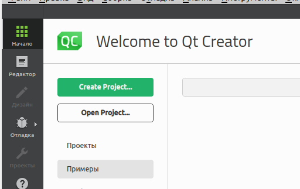 

1. ` `Далее Приложение (Qt) -> Приложение Qt Widgets –> Выбрать

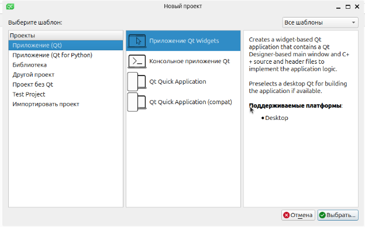

1. ` `Название проекта и путь можно оставить без изменений:

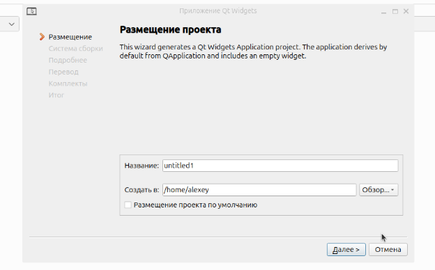

1. ` `Нажать кнопку далее
1. ` `Выбрать систему сборки CMake:

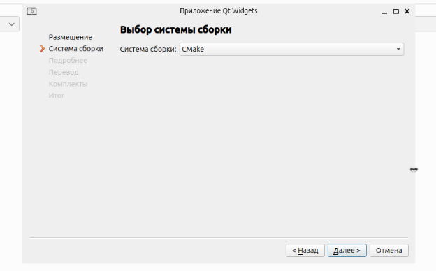

1. Информацию о классе оставить без изменений:

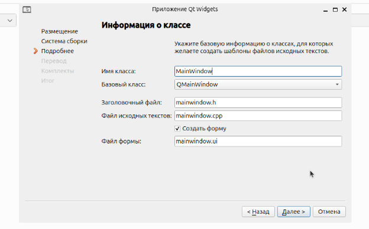

1. ` `Файл переводов оставить без изменений:

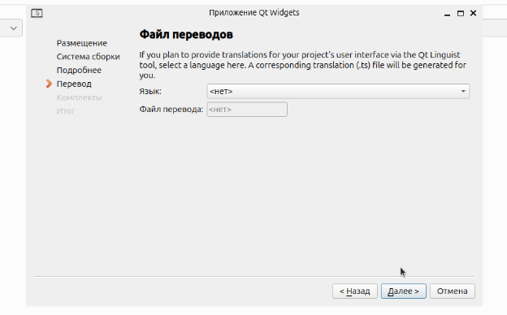

1. ` `Выбрать комплект Desktop (выбран по умолчанию):

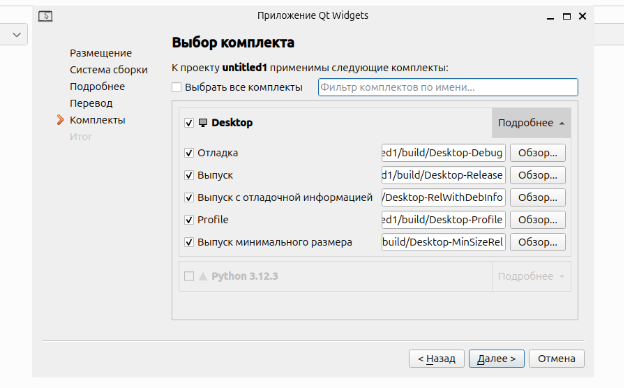

1. ` `Систему контроля версий оставить без изменений:

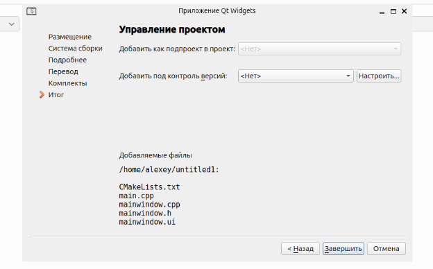

1. Нажать кнопку завершить
1. Запустить проект (зелёная треугольная кнопка) или сочетание клавиш Ctrl+R:

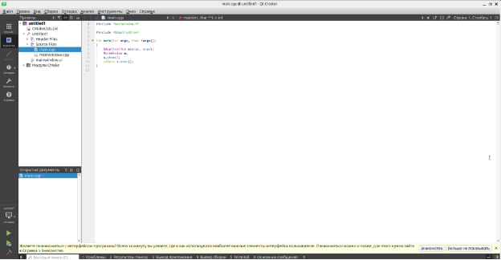

1. Если программа запущена, значит Qt успешно установлен:

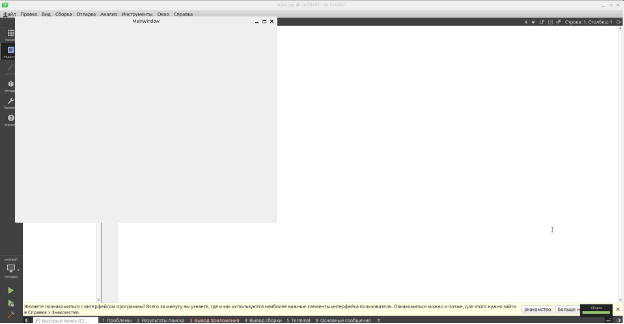

1. ` `Если комплект Desktop недоступен:
   1. Проверьте установку пакетов: sudo apt-get install build-essential cmake gcc g++
   1. Создаёте комплект Desktop самостоятельно:
      1. Выберите Правка -> Preferences:

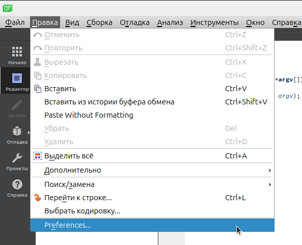

1. В настройках выберите Комплекты -> Комплекты -> Особые -> Desktop:

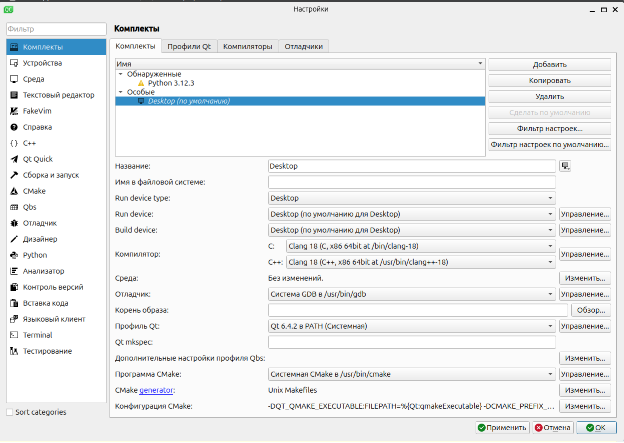

1. Если комплект Desktop отсутствует, создайте его с помощью кнопки Добавить:

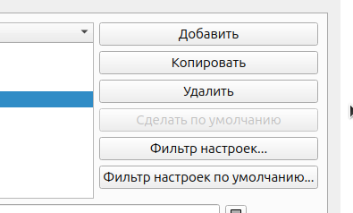

1. Проверьте, что указаны компиляторы C++, отладчик, версия Qt и cmake: 

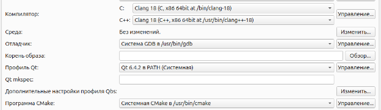

1. Если не какие-то параметры не определяются, их необходимо добавить вручную, на следующих вкладках:
1. Вкладка Профили Qt:
   1. На этой вкладке должен быть указан путь к Qt6 (по умолчанию путь /usr/bin/qmake6 ):

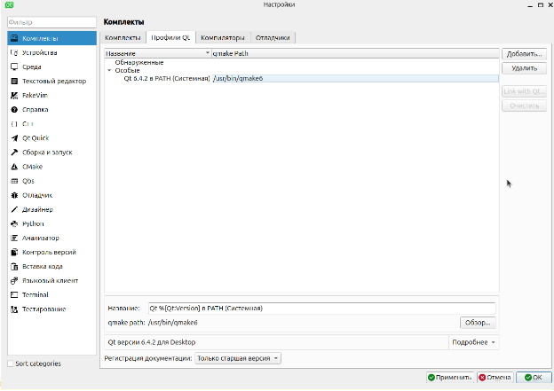

1. Если он указан, добавить его через кнопку Добавить.
1. Вкладка компиляторы:
   1. По аналогии проверить наличие путь к компилятору g++ и добавить его при необходимости:

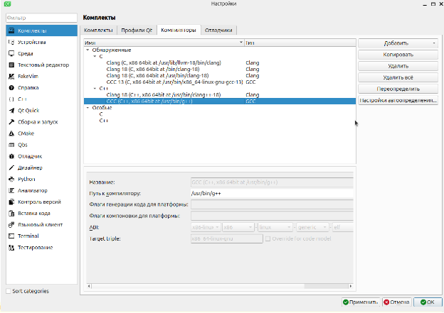

1. Вкладка отладчики:
   1. Отладчики должны быть обнаружены автоматически:

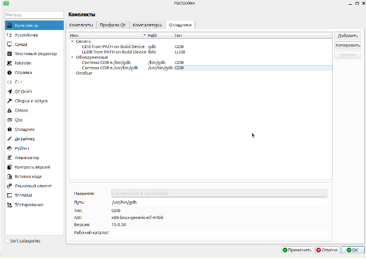

1. Если все пути указаны, нажать кнопку Применить и Ок.
1. Вернуться к пункту 9.
